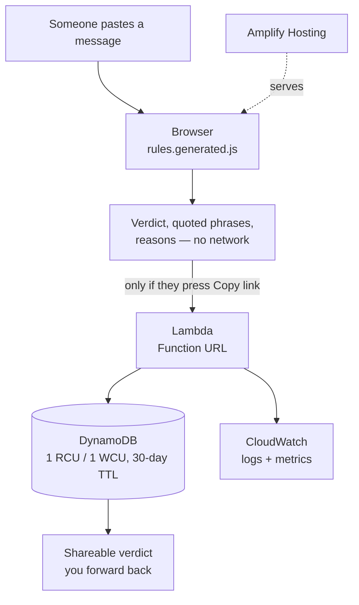

# Pakka

**Check before you pay.**

Paste a message you were sent — a PG listing, an internship offer, a bank SMS —
and Pakka tells you which parts of it are a problem and why, in words you can
forward straight back to the person who sent it to you.

**Live:** https://vaibhav375.github.io/pakka/ · **Run it locally:** see below.

---

## The problem

A friend forwards you a WhatsApp message. *Selected without interview, pay ₹1,499
registration fee within 2 hours.* You are fairly sure it is a scam. Your cousin
in second year is not, and by the time they ask anyone, the money is gone.

Scam-spotting is a skill people acquire by being scammed. Every tool that exists
to help is either an app you have to install, a helpline you have to call after
the fact, or a "report this" button that helps somebody else next month.

What is missing is small: a way to check a message in ten seconds, and — this is
the part that matters — **something you can send back**. Telling your cousin "that
looks fake" is an opinion. Sending them a page that quotes their own message and
explains that legitimate employers never charge candidates is an argument.

## What it does

1. You paste the message.
2. Thirteen rules run **in your browser**. Each one knows how to find itself in
   the text and can say, in a sentence, why what it found is a problem.
3. You get a verdict, the exact phrases that caused it, and the reasoning.
4. If you want to forward it, one button mints a link. That is the only moment
   anything leaves your device.

## Why the verdict is not decided by a model

A language model would be the obvious way to build this, and it is the wrong one.

A scam verdict has to be **the same every time** — the same message cannot be
"probably fine" on Tuesday. It has to be **explainable to someone who is about to
lose money**, which means quoting their message and naming the reason, not
producing a confidence score. And it must never **invent** a reason, because a
plausible-sounding wrong explanation is worse than no explanation.

So the decision lives in `api/rules.py`, in thirteen regular expressions with
weights and human-written reasons. No model gets a vote. The trade-off is real
and worth stating: rules only catch patterns someone thought of, so Pakka will
miss novel scams. The interface says so rather than implying it is a guarantee.

## Architecture



The rules exist once, in Python. `tools/build_rules_js.py` generates the browser
copy, and `tools/check_parity.py` runs both over the same messages and fails if
they ever disagree — which is the only thing that makes a generated file safe to
trust.

## How AWS is used

**Build It — open-source, local, no account**

| Tool | What it does here |
|---|---|
| **AWS SAM CLI** | `template.yaml` defines the whole stack — function, table, TTL, Function URL. `sam validate` checks it; the same file is what deploys. |
| **Lambda programming model** | `api/handler.py` is a Lambda handler. `api/local_server.py` wraps that exact function in a stdlib HTTP server, so what runs on a laptop is the code that runs in production, not a sibling of it. |

```bash
python3 api/local_server.py        # the API, no account, no credentials
python3 -m http.server 5500 -d web # the front end
python3 api/test_rules.py          # the rules
python3 tools/check_parity.py      # python and javascript agree
```

**Ship It — deployed**

| Service | Why this one |
|---|---|
| **Lambda** | The work is one short burst per scan. 1M requests a month are free, and nothing runs between scans. |
| **Lambda Function URL** | An HTTPS endpoint with CORS and no extra cost. API Gateway would add a hop and a bill we do not need for two routes. |
| **DynamoDB** | Key-value by design: one shareable id, one record. Provisioned at 1 read and 1 write unit, inside the always-free 25. A 30-day TTL deletes rows without a cleanup job. |
| **Amplify Hosting** | Git push to HTTPS. `amplify.yml` declares no build step, so build minutes stay near zero. |
| **CloudWatch** | Logs and metrics for the function, which is the only moving part. |

### The cost reasoning

This is a free tool for people about to lose money, so it has to cost nothing
when idle, and the architecture is chosen for that:

- **Nothing runs between scans.** No container, no instance, no idle bill.
- **The expensive part is free.** Rules run on the user's device. Scanning
  costs us nothing at all — the cloud is only involved when someone shares.
- **Provisioned, not on-demand.** DynamoDB on-demand is the better choice for
  spiky real traffic, but it bills from the first request. 1/1 provisioned is
  inside the always-free allowance.
- **No build step.** Amplify's free tier includes 1,000 build minutes; a static
  page uses roughly none of them.

At 1,000 scans a day, only the shared ones touch AWS. Assuming one in ten is
shared, that is ~3,000 writes and reads a month — comfortably inside the free
allowances, so the bill stays at zero until this is considerably more popular
than it deserves to be.

## Tests

```
$ python3 api/test_rules.py
  pass  fake internship                    score=7
  pass  kyc phishing                       score=10
  pass  fake pg listing                    score=6
  pass  refund bait                        score=4
  pass  ordinary message, must stay clean  score=0
```

The last case is the one that matters. A checker that flags everything gets
ignored, and then it protects nobody.

## What this does not do

- It is **not a guarantee**. Thirteen rules catch thirteen shapes of scam. A
  message that trips none of them has not been cleared, only not recognised —
  and the interface says exactly that rather than showing a reassuring tick.
- It reads **English and common Hinglish spellings** only.
- It is **not legal or financial advice**.

## Built with

Written during First Commit (AWS × WeMakeDevs), 17–20 September 2026.

Python 3.12 (stdlib only — no dependencies), vanilla JavaScript, AWS SAM,
Lambda, DynamoDB, Amplify Hosting, CloudWatch. Smooth scrolling by
[Lenis](https://lenis.dev). Type is Space Grotesk and Space Mono.

**AI tools used:** Claude (Anthropic) was used as a coding assistant throughout —
for drafting the rule patterns, the front-end code, and this README. Every rule,
weight and explanation was reviewed and edited by hand; the test cases and the
parity check exist because generated code needs something that checks it.
